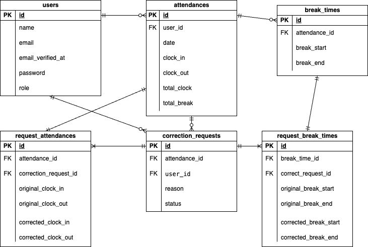

## アプリケーション名
  coachtech 勤怠管理アプリ
## 環境・使用技術
・Laravel Framework: 8.83.8
・nginx: 1.21.1
・PHP: 7.4.9
・mysql: 15.1
・Mailtrap
・Strip
## 環境構築
```
1. 下記でディレクトリ内にクローンしてください。
  $ git clone git@github.com:riku37-create/miyaharariku-mogi2.git
2. 開発環境を構築するため、以下のコマンドを実行してください。
  $ docker-compose up -d --build
3. Laravel のパッケージのインストールを行うため下記のコマンドを実行してください。
  $ docker-compose exec php bash
  $ composer install
4. データベースに接続するために、.env.exampleファイルをコピーして、.envファイルを作成します。
  PHPコンテナ内で、以下のコマンドを実行してください。
  $ cp .env.example .env
5. VSCode から.envファイルの11行目以降を以下のように修正してください。
  DB_CONNECTION=mysql
  - DB_HOST=127.0.0.1
  + DB_HOST=mysql
  DB_PORT=3306
  - DB_DATABASE=laravel
  - DB_USERNAME=root
  - DB_PASSWORD=
  + DB_DATABASE=laravel_db
  + DB_USERNAME=laravel_user
  + DB_PASSWORD=laravel_pass
6. アプリケーションを実行できるように、PHPコンテナで以下のコマンドを実行してください。
  $ php artisan key:generate
7. データベースのマイグレーションとシーディングを行うため、PHPコンテナで以下のコマンドを実行してください。
  $ php artisan migrate --seed
8.画像表示するためにシンボリックリンクの設定を追加するため、PHPコンテナで以下のコマンドを実行してください。
  $ php artisan storage:link
9. ログファイルの書き込み権限エラーが発生する場合は、以下のコマンドを実行しもう一度コマンドを実行しなおしてください。
  $ chmod -R 777 src/storage
10. mail認証機能を、テストする為に、[Mailtrap](https://mailtrap.io/)にアクセスし、アカウントを作成してください。
11. ログイン後、左メニューにある Email Testing リンクをクリック、もしくは画面中央あたりの Email Testing の「Start Testing」ボタンをクリックしてください。
12. SMTP Settingsタブをクリックして、integrationセレクトボックスで、laravel8を選択し、copyボタンをクリックし、.envファイルの下記のデフォルト部分にペーストし、上書きしてください。
  - MAIL_MAILER=log
  - MAIL_HOST=127.0.0.1
  - MAIL_PORT=2525
  - MAIL_USERNAME=null
  - MAIL_PASSWORD=null
  - MAIL_ENCRYPTION=null
13. .envファイルを書き終えたら、PHPコンテナで以下のコマンドを実行してください。
  $ php artisan config:clear


```
## テスト実行
```
1. srcディレクトリにある.envをコピーして.env.testingというファイルを作成してください。
  $ cp .env .env.testing
2. ファイルの作成ができたたら、.env.testingファイルの文頭部分にあるAPP_ENVとAPP_KEYを編集してください。
  APP_NAME=Laravel
  - APP_ENV=local
  - APP_KEY=base64:vPtYQu63T1fmcyeBgEPd0fJ+jvmnzjYMaUf7d5iuB+c=
  + APP_ENV=test
  + APP_KEY=
  APP_DEBUG=true
  APP_URL=http://localhost
3. .env.testingにデータベースの接続情報を加えてください
  DB_CONNECTION=mysql
  DB_HOST=mysql
  DB_PORT=3306
  - DB_DATABASE=laravel_db
  - DB_USERNAME=laravel_user
  - DB_PASSWORD=laravel_pass
  + DB_DATABASE=demo_test
  + DB_USERNAME=root
  + DB_PASSWORD=root
4. MySQLコンテナからMySQLに、rootユーザでログインして、demo_testというデータベースを作成してください。
  $ docker-compose exec mysql bash
  $ mysql -u root -p
パスワードは root を入力してください。
  CREATE DATABASE demo_test;
5. アプリケーションキーを加えるために以下のコマンドを実行してください
  $ docker-compose exec php bash
  $ php artisan key:generate --env=testing
6. 下記コマンドを実行してください
  $ php artisan config:clear
7. マイグレーションコマンドを実行して、テスト用のテーブルを作成してください
  $ php artisan migrate --env=testing
8. 全てのテストを実行する場合、下記のコマンドを実行してください
  $ php artisan test
9. 特定のテストファイルのみを実行する場合(ProductTestの場合)、下記のコマンドを実行してください
  $ php artisan test --filter ProductTest
```

## ER図

